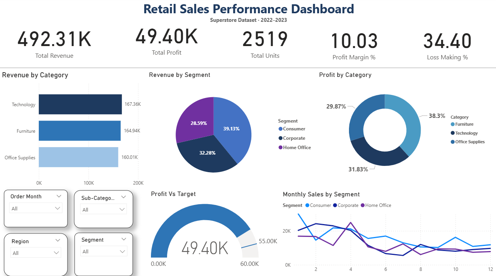
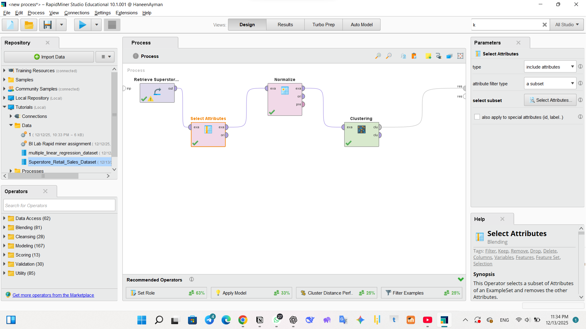
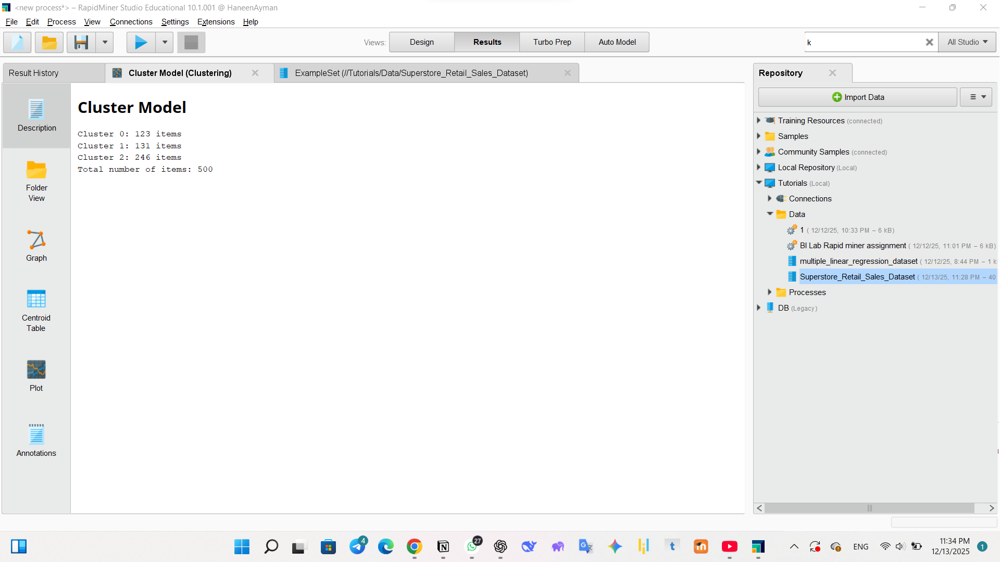
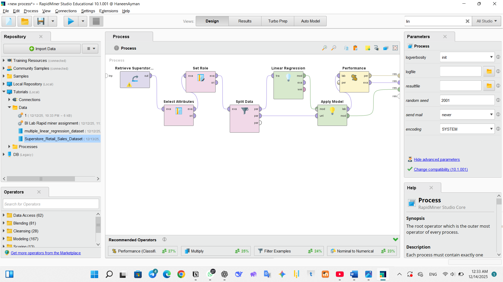
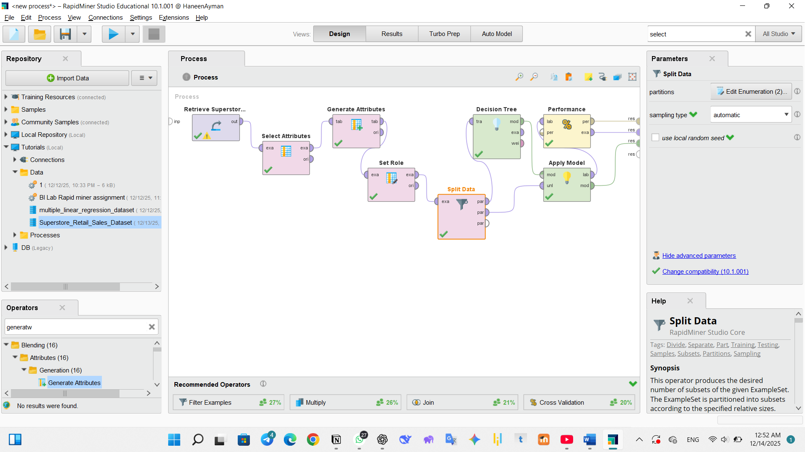
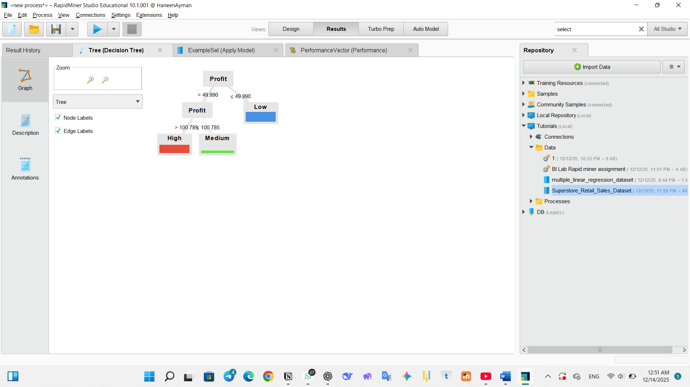

# Retail Sales Performance Analysis
### Business Intelligence & Machine Learning Project

**Haneen Ayman Mohamed** · Business Information Systems · Galala University · 2025  
[](https://www.linkedin.com/in/haneen-ayman-240051387)

---

## Project Overview

An end-to-end data analysis project combining **Power BI dashboarding** and **three machine learning models** in RapidMiner Studio to analyze 500 retail orders across 2022–2023.

The goal was to go beyond surface-level reporting and uncover what actually drives profitability — translating raw transaction data into actionable business intelligence around discount strategy, customer segmentation, and profit prediction.

---

## Key Findings

| Metric | Value |
|---|---|
| Total Revenue | $492,309 |
| Total Profit | $49,403 |
| Profit Margin | 10.03% |
| Loss-Making Orders | **34.4%** (172 of 500 orders) |
| Total Units Sold | 2,519 |

**4 critical insights from the analysis:**

- **Hidden margin losses** — 172 orders generated -$16,770 in absorbed losses, invisible without a classification model to flag them proactively
- **Discount danger zone** — orders with discounts ≥20% had a 35.2% loss rate vs 31.9% for undiscounted orders; aggressive discounting is a measurable profit drain
- **Revenue ≠ profitability** — Consumer segment led revenue at $192.6K, yet Central region delivered the highest profit at $16,512; volume and margin don't always align
- **Segmentation opportunity** — 246 of 500 customers (49.2%) fall in the low-value cluster, signaling that retention beats acquisition as a growth strategy

---

## Dataset

| Attribute | Detail |
|---|---|
| Source | Superstore Retail Sales Dataset |
| Period | January 2022 – May 2023 |
| Records | 500 orders |
| Fields | Order Date, Customer ID, Segment, Region, Category, Sub-Category, Sales, Quantity, Discount, Profit |

---

## Tools & Technologies

`Power BI` &nbsp; `RapidMiner Studio 10.1` &nbsp; `K-Means Clustering` &nbsp; `Decision Tree` &nbsp; `Linear Regression` &nbsp; `DAX` &nbsp; `CSV`

---

## Part 1 — Power BI Dashboard

### Data Preparation
- Removed duplicates, corrected data types, resolved missing values
- Created computed columns: Profit Margin %, Order Month Number
- Built DAX measures using `CALCULATE` + `ALL()` for context-independent KPIs

### Dashboard Visuals

| Visual | Type | Purpose |
|---|---|---|
| Revenue by Category | Horizontal Bar | Sales split across Technology, Furniture, Office Supplies |
| Revenue by Segment | Donut Chart | Consumer / Corporate / Home Office breakdown |
| Profit by Category | Donut Chart | Profitability contribution by category |
| Monthly Sales by Segment | Line Chart | Sales trend Jan–May across customer segments |
| Profit vs Target | Gauge | $49.4K actual vs $55K target |
| Slicers | Dropdown | Order Month, Sub-Category, Region, Segment |

### KPI Cards
| KPI | Value |
|---|---|
| Total Revenue | $492.31K |
| Total Profit | $49.40K |
| Total Units Sold | 2,519 |
| Profit Margin % | 10.03% |
| Loss Making % | 34.40% |

---

## Part 2 — Machine Learning Models (RapidMiner Studio)

### A · Clustering — K-Means

**Objective:** Segment customers by purchase behavior  
**Features:** Sales, Profit, Quantity, Discount  
**Pipeline:** Retrieve Data → Select Attributes → Normalize → Clustering

| Cluster | Size | Profile |
|---|---|---|
| High-Value | 123 orders | High sales & profit |
| Medium-Value | 131 orders | Moderate performance |
| Low-Value | 246 orders | Low sales & profit |

**Business application:** Targeted loyalty programs for high-value customers; upsell campaigns for medium-value; re-engagement strategies for low-value.




---

### B · Regression — Linear Regression

**Objective:** Predict profit value for new orders  
**Target:** Profit  
**Features:** Sales, Quantity, Discount  
**Pipeline:** Retrieve Data → Select Attributes → Set Role → Split Data → Linear Regression → Performance → Apply Model  
**Metrics:** RMSE, MAE, R²

**Finding:** Sales and quantity positively affect profit; every unit increase in discount rate systematically reduces it.



---

### C · Classification — Decision Tree

**Objective:** Classify orders as High / Medium / Low profit before fulfillment  
**Target:** Profit_Class (derived from Profit column)  
**Features:** Sales, Quantity, Discount  
**Pipeline:** Retrieve Data → Select Attributes → Generate Attributes → Set Role → Split Data → Decision Tree → Performance → Apply Model  
**Metrics:** Accuracy, Precision, Recall, F1-Score

**Key decision rule from the tree:** Orders with Profit ≤ 49.99 are classified Low; above 100.785 are classified High.




---

## Conclusion

This project demonstrates how combining interactive BI dashboards with predictive machine learning delivers insights that neither tool provides alone. Power BI exposed the sales trends and category patterns; the ML models went further — clustering customers by value, predicting profit outcomes, and classifying orders before they become losses.

**The business recommendation is clear:** revise discount thresholds above 20%, prioritize retention of the 123 high-value customers, and redirect marketing spend from volume-chasing to margin improvement.

---

## Repository Structure

```
Retail-Sales-Analysis/
│
├── README.md
│
├── LICENSE
│
├── data/
│   └── Superstore_Retail_Sales_Dataset.csv
│
├── powerbi/
│   └── PowerBI.pbix
│
├── rapidminer/
│   ├── Clustering_Model.rmp
│   │
│   ├── Regression_Model.rmp
│   │
│   └── Classification_Model.rmp
│
├── screenshots/
│   ├── dashboard.png
│   │  
│   ├── Clustering_Model_Design.png
│   │
│   ├── Cluster_Graph.png
│   │
│   ├── Classification_Model_Design.png
│   │   └── RapidMiner process view of the Decision Tree pipeline
│   │
│   ├── Classification_Tree.png
│   │
│   └── Regression_Model_Design.png
│
└── summary/
    └── Retail_Sales_Performance_Summary.pdf

```

---

## How to Use

**Power BI Dashboard**
1. Download `powerbi/PowerBI.pbix`
2. Open in Power BI Desktop (free download from Microsoft)
3. Repoint the data source to `data/Superstore_Retail_Sales_Dataset.csv` if prompted

**RapidMiner Models**
1. Download any `.rmp` file from `rapidminer/`
2. Open in RapidMiner Studio (Educational version is free)
3. Import `data/Superstore_Retail_Sales_Dataset.csv` into your repository
4. Run the process

---

*Haneen Ayman Mohamed · haneenayman23@outlook.com · Galala University, Suez, Egypt*
